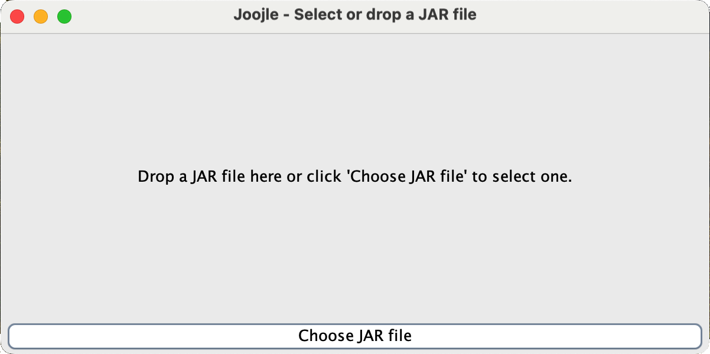
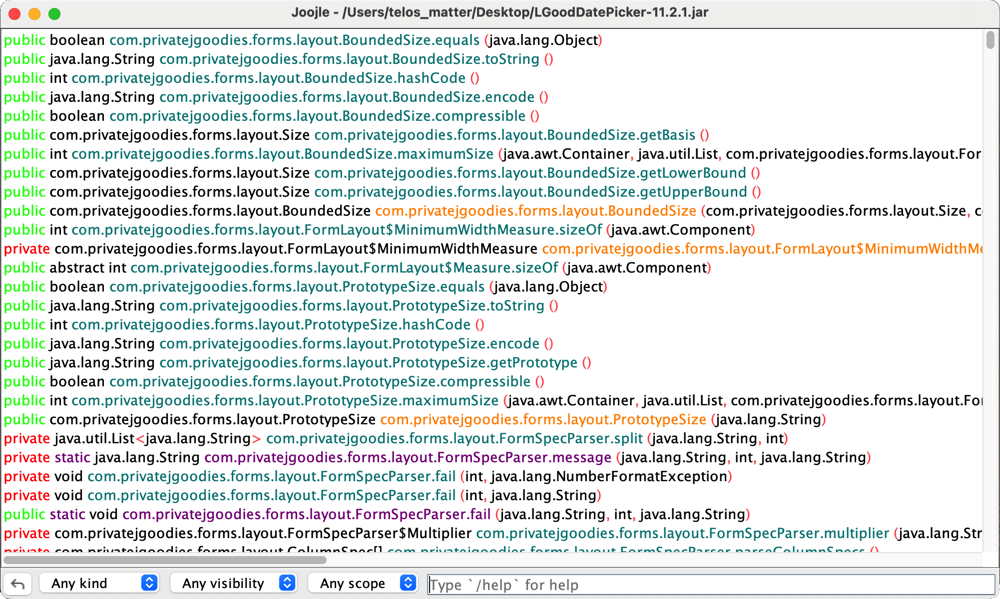
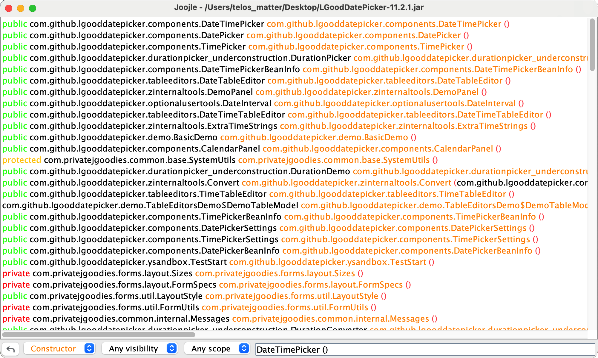
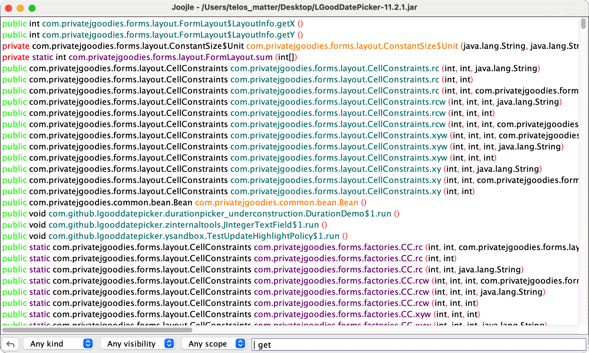

# Joojle &nbsp; 

A knockoff version of [Hoogle](https://hoogle.haskell.org/) but for Java.
<br><br>
**Heavily** inspired by <a href="https://www.twitch.tv/tsoding">Tsoding</a>, more
specifically from these <a href="https://youtube.com/playlist?list=PLpM-Dvs8t0VYhYLxY-i7OcvBbDsG4izam&si=aBJkIpS3pjflStvS">streams</a>. With a couple of added features like filtering by method kind, visibility, or scope.

## How-to
### Usage:
A user interface has been implemented which makes the usage pretty straight forward. Simply drop the JAR file you want to search in and type your query. You could also search by method name.
<br><br>
If you need help on the query structure you could simply type `/help` and you will be presented with an explanation of the query structure, and a couple of examples.

### Running:
The project is a Maven project, so after cloning the repository you could simply run:
```console
$ mvn clean compile exec:java
```

## UI/UX:
Here are some screenshots of what the user is presented with:
### First window to drop or select the JAR file:

### When the JAR file has been loaded:

### Searching for a constructor for example:

### Searching by name:

